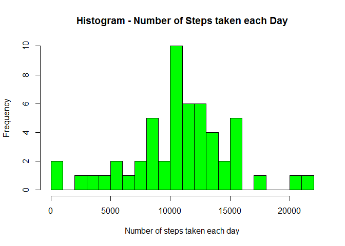
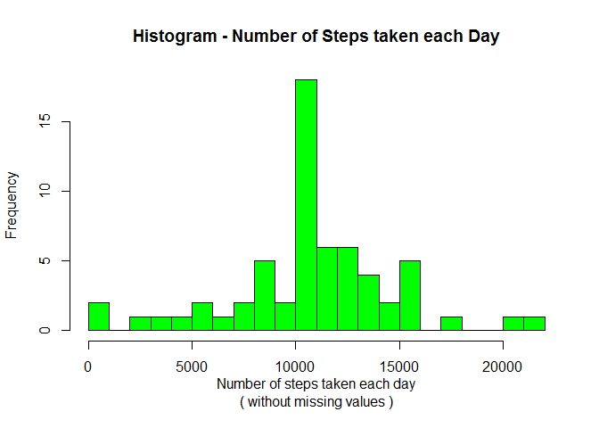

# Reproducible Research: Peer Assessment 1


### Step 1 - Loading and preprocessing the data

Load needed R packages ...

```r
getwd()
```

```
## [1] "C:/MyRProjects/R-Codes"
```

```r
library(data.table) 
library(dplyr)
library(ggplot2)
```

Download and unzip the input data file ...

```r
if(!file.exists("activity.zip")) {
    temp <- tempfile()
    download.file("http://d396qusza40orc.cloudfront.net/repdata%2Fdata%2Factivity.zip",temp)
    unzip(temp)
    unlink(temp)
}
```

Read the unzipped .csv input data file ... 

```r
df <- read.csv("activity.csv")

str(df) 
```

```
## 'data.frame':	17568 obs. of  3 variables:
##  $ steps   : int  NA NA NA NA NA NA NA NA NA NA ...
##  $ date    : Factor w/ 61 levels "2012-10-01","2012-10-02",..: 1 1 1 1 1 1 1 1 1 1 ...
##  $ interval: int  0 5 10 15 20 25 30 35 40 45 ...
```


### Step 2 - What is mean total number of steps taken per day?

Using **Aggregate** fucntion to calculate the total number of steps by day ...

```r
steps_by_day <- aggregate(steps ~ date, df, sum)

head(steps_by_day)
```

```
##         date steps
## 1 2012-10-02   126
## 2 2012-10-03 11352
## 3 2012-10-04 12116
## 4 2012-10-05 13294
## 5 2012-10-06 15420
## 6 2012-10-07 11015
```

Create a **histogram** showing the total number of steps taken each day ...

```r
hist(steps_by_day$steps, 
     main   = "Histogram - Number of Steps taken each Day", 
     xlab   = "Number of steps taken each day", 
     ylab   = "Frequency",
     breaks = 20,
     col    = "green")
```

 

Calculate the **mean** of the total number of steps taken each day ...

```r
mean1 <- mean(steps_by_day$steps)

mean1
```

```
## [1] 10766.19
```

Calculate the **median** of the total number of steps taken each day ...

```r
median1 <- median(steps_by_day$steps)

median1
```

```
## [1] 10765
```


### Step 3 - What is the average daily activity pattern?

Calculate the **average** number of steps taken across all days by interval ...

```r
avg_steps_by_interval <- aggregate(steps ~ interval, df, mean)

head(avg_steps_by_interval,5)   ## str(avg_steps_by_interval)
```

```
##   interval     steps
## 1        0 1.7169811
## 2        5 0.3396226
## 3       10 0.1320755
## 4       15 0.1509434
## 5       20 0.0754717
```

Let's find the **index** of the 5-minutes interval, on average across all days in the dataset, that contains the maximum number of steps ...

```r
index_max <- which.max(avg_steps_by_interval$steps)

index_max
```

```
## [1] 104
```

Then, get the **row** that contains the max values first so we can plot on the chart too ...

```r
row_max <- avg_steps_by_interval[index_max,]

row_max
```

```
##     interval    steps
## 104      835 206.1698
```

Now, create a time series plot `type = "l"` of 5-minutes interval (x-axis) and the **average** number of steps taken across all days (y-axis) ...

```r
  ggplot(avg_steps_by_interval, aes(x = interval, y = steps)) + 
       geom_line() + 
       geom_point() +
       geom_vline(xintercept = row_max[[1]], 
                  colour = "red", 
                  linetype = "dashed") +
       geom_hline(yintercept = max(avg_steps_by_interval$steps), 
                  colour = "red", 
                  linetype = "dashed") +
       geom_text(aes(row_max[[1]],0, 
                     label = row_max[[1]], 
                     hjust=-0.5), 
                     colour="blue", 
                     size=4) +
       geom_text(aes(0,row_max[[2]], 
                     label = round(row_max[[2]],2), 
                     vjust=-0.5), 
                     colour="blue", 
                     size=4) +  
       ggtitle("Average number of steps by 5-minutes interval \n") +
       labs(x = "\n 5-minutes interval") + 
       labs(y = "Average number of steps \n")
```

 


### Step 4 - Imputing missing values

The total number of missing values in the dataset is ....

```r
sum(!complete.cases(df))
```

```
## [1] 2304
```

Use the average number of steps per 5-minutes interval ( calculated in previous question ), to replace the **N/A** values in the dataset ... 

```r
library(magrittr)

df2 <- inner_join(df, avg_steps_by_interval, by="interval") %>% 
                  mutate(steps=ifelse(is.na(steps.x),steps.y,steps.x)) %>%
                  select(date,interval,steps)
```


Let's verify the new dataset ...

```r
sum(!complete.cases(df2))
```

```
## [1] 0
```

Then, aggregate the number of steps by day for the new dataset ...

```r
steps_by_day2 <- aggregate(steps ~ date, df2, sum)

head(steps_by_day2)
```

```
##         date    steps
## 1 2012-10-01 10766.19
## 2 2012-10-02   126.00
## 3 2012-10-03 11352.00
## 4 2012-10-04 12116.00
## 5 2012-10-05 13294.00
## 6 2012-10-06 15420.00
```
  
There is no missing values in the new dataset. So, let's create the **histogram** again ...

```r
hist(steps_by_day2$steps, 
     main   = "Histogram - Number of Steps taken each Day", 
     xlab   = "\n Number of steps taken each day \n( without missing values )", 
     ylab   = "Frequency",
     breaks = 20,
     col    = "green")
```

 

Recalculate the **mean** of the total number of steps taken each day ...

```r
mean2 <- mean(steps_by_day2$steps)

mean2
```

```
## [1] 10766.19
```

Recalculate the **median** of the total number of steps taken each day ...

```r
median2 <- median(steps_by_day2$steps)

median2
```

```
## [1] 10766.19
```

**Note:** The **mean** of the number of steps taken each day remains the same because the missing values is replaced with the average. The **median** is now equal to the **mean**. 


### Step 5 - Are there differences in activity patterns between weekdays and weekends?

Create factor variables **"weekday"** and **"weekday"** in the filled-in missing values dataset  ...

```r
df3 <- transform(df2, 
                 day_type = ifelse(weekdays(as.Date(steps_by_day2$date)) == "Saturday" | 
                                   weekdays(as.Date(steps_by_day2$date)) == "Sunday", 
                                   "weekend", "weekday")
                 )

str(df3)
```

```
## 'data.frame':	17568 obs. of  4 variables:
##  $ date    : Factor w/ 61 levels "2012-10-01","2012-10-02",..: 1 1 1 1 1 1 1 1 1 1 ...
##  $ interval: int  0 5 10 15 20 25 30 35 40 45 ...
##  $ steps   : num  1.717 0.3396 0.1321 0.1509 0.0755 ...
##  $ day_type: Factor w/ 2 levels "weekday","weekend": 1 1 1 1 1 2 2 1 1 1 ...
```

Make a panel containing a time series plot (i.e. type = "l") of the 5-minute interval (x-axis) and the average number of steps taken, averaged across all weekday days or weekend days (y-axis) ...

```r
avg_steps_by_interval_day_type <- aggregate(steps ~ interval + day_type, df3, mean)

ggplot(avg_steps_by_interval_day_type, aes(x = interval, y = steps)) + 
      geom_line( col = "blue" ) + 
      facet_wrap(~ day_type, ncol = 1) +
      ggtitle("Average number of steps each day by interval \n( Weekday vs. Weekend ) \n") +
      labs(x = "\n 5-minutes interval") + 
      labs(y = "Average number of steps taken \n")
```

 
  
  
